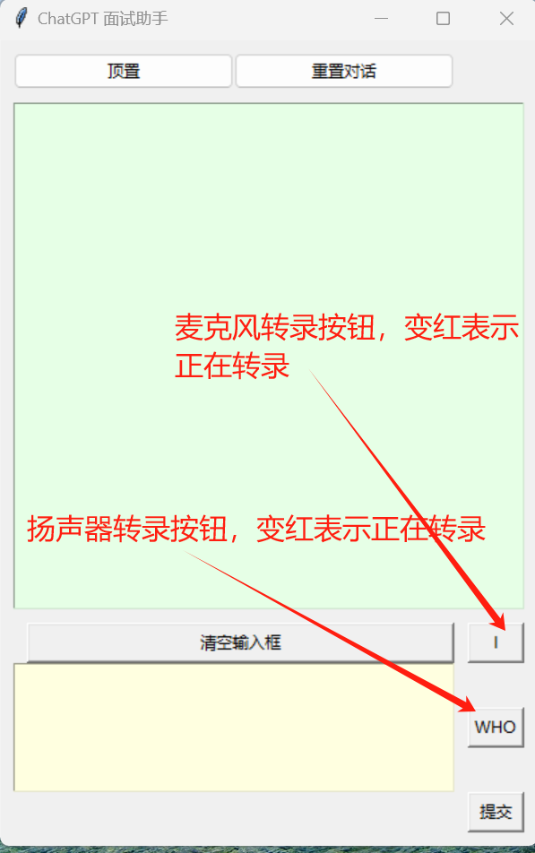
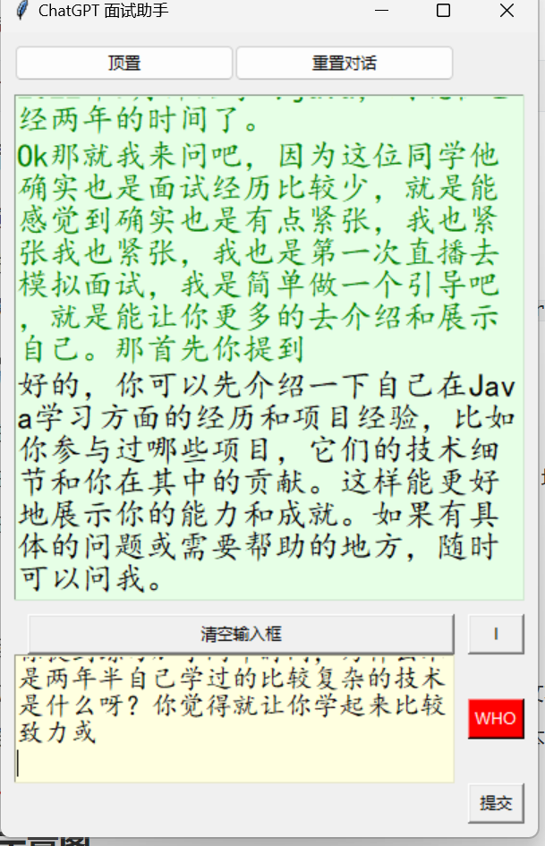

利用阿里云实时语音识别 API ，实现扬声器和麦克风的双重转录。转录结果实时显示在界面上，用户可通过按下ENTER键将文本发送给 GPT 进行智能问答。以下是使用方法

### 1. 安装相应的Python库

在终端或命令行中运行以下命令以安装所需的Python库：

```bash
pip install tkinter pyyaml openai requests pyaudio numpy
```

### 2. 申请阿里云语音识别的凭证

- 前往阿里云官网，注册或登录您的账户。
- 进入语音识别服务页面，申请一个新的应用。
- 获取您的 `APPKEY`、`access_key_id` 和 `access_key_secret`，填写在`base_data.yaml`文件中。

### 3. 填写GPT的访问信息

- 注册或登录OpenAI账户，获取GPT的访问权限。
- 在OpenAI等平台上获取 `ChatGPT_url` 和 `ChatGPT_key`，填写在`base_data.yaml`文件中。
- 在代码中填写这些信息，以便调用GPT进行智能问答。

### 4. 项目运行

- 运行项目代码，应用将启动并显示用户界面。
- 应用会同时捕获扬声器和麦克风的音频输入，实时转录为文本。
- 转录结果会显示在界面上，用户可通过按下ENTER键将文本发送给GPT。
- GPT将根据输入文本生成回答，并在界面上显示结果。

### 5.运行示意图






